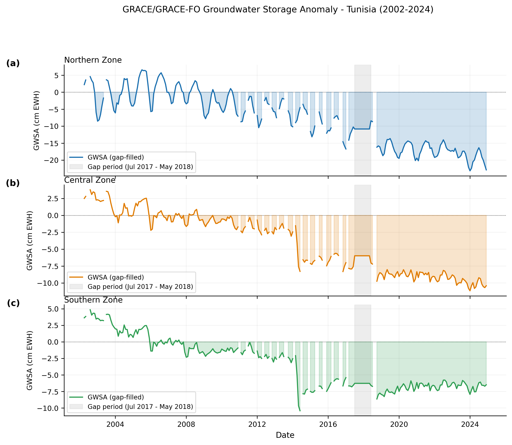
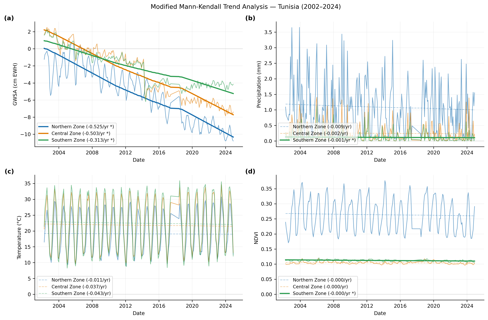

<div align="center">


<br/>

[](https://doi.org/10.5281/zenodo.[RECORD_ID])
[](LICENSE)
[](https://www.python.org/)
[](https://www.frontiersin.org/journals/big-data)
[]()

<br/>

> **Majdi Argoubi** [](https://orcid.org/0000-0002-6560-5153) · University of Sousse, Tunisia
> 
> **Khaled Mili** [](https://orcid.org/0000-0002-6309-5452) · Corresponding author ✉️

</div>

---

## 📖 About

This repository provides the **complete, reproducible pipeline** for the paper:

> *Satellite-Based Big Data Analysis of Groundwater Depletion and Water Stress Dynamics Under Climate Change in Arid Regions: A Case Study of Tunisia*
> **Frontiers in Big Data** — Data-driven Climate Sciences (2025)

We integrate **GRACE/GRACE-FO**, **ERA5**, **MODIS NDVI**, and **GLDAS** through a modular 9-module Python pipeline to analyse groundwater storage anomalies (GWSA) across three hydro-climatic zones in Tunisia over 2002–2024, and project future trajectories through 2030 under SSP2-4.5 and SSP5-8.5.

---

## 🗺️ Study Area

Tunisia is divided into **three hydro-climatic zones**:

| Zone | Latitude | Precipitation | Key aquifer systems |
|------|----------|--------------|---------------------|
| 🟢 **North** | 34–37.5°N | 400–1500 mm/yr | Coastal phreatic, Zaghouan |
| 🟡 **Central** | 32–34°N | 150–400 mm/yr | Kairouan, Continental Intercalaire |
| 🔴 **South** | 30–32°N | < 150 mm/yr | NWSAS, Continental Intercalaire |

---

## 📊 Key Results

<div align="center">

| Zone | Sen's slope | Cumulative depletion | 2023–2024 stress |
|------|------------|----------------------|-----------------|
| 🟢 North | −0.525 cm EWH yr⁻¹ *** | −11.6 cm EWH | **92% High/Critical** ⚠️ |
| 🟡 Central | −0.503 cm EWH yr⁻¹ *** | −11.1 cm EWH | 56% High/Critical |
| 🔴 South | −0.313 cm EWH yr⁻¹ *** | −6.9 cm EWH | 56% High/Critical |

*\*\*\* p < 0.001 — Modified Mann-Kendall test*

</div>

**No groundwater recovery is projected through 2030 under any emission scenario.**

---

## 🔬 Pipeline Overview

```
GRACE/GRACE-FO  ──┐
ERA5 (P, T2m)   ──┤
MODIS NDVI      ──┤──► 01 Preprocessing ──► 02 Gap Filling ──► 03 Downscaling (1 km)
GLDAS NOAH/VIC  ──┘         │                    │                    │
                             └────────────────────┴────────────────────┘
                                                  │
                             ┌────────────────────▼────────────────────┐
                             │         04 Feature Engineering           │
                             └────────────────────┬────────────────────┘
                                                  │
               ┌──────────────┬───────────────────┼───────────────────┐
               ▼              ▼                   ▼                   ▼
        05 NDVI          06 Trend           07 Water Stress    08 Prediction
        Emulator         Analysis           Classification     & Projections
       (SSP2-4.5/       (MMK test)         (K-Means + RF)    (SARIMAX/LSTM/
        SSP5-8.5)                                              XGBoost)
               └──────────────┴───────────────────┴───────────────────┘
                                                  │
                                         09 Visualization
                                        (Publication figures)
```

---

## 📈 Figures

<div align="center">

| Study Area | GWSA Time Series |
|:---:|:---:|
|  |  |

| MMK Trends | Water Stress |
|:---:|:---:|
|  |  |

| Prediction Validation | SSP Projections |
|:---:|:---:|
|  |  |

</div>

---

## ⚙️ Installation

```bash
# Clone
git clone https://github.com/ARGOUBI25/tunisia-groundwater-depletion.git
cd tunisia-groundwater-depletion

# Conda (recommended)
conda env create -f environment.yml
conda activate tunisia-gw

# Or pip
pip install -r requirements.txt
```

---

## 🗄️ Data Access

Raw data (~15 GB) is **not included** in this repository. Download instructions in [`scripts/00_download_guide.md`](scripts/00_download_guide.md).

| Dataset | Source | Size |
|---------|--------|------|
| GRACE/GRACE-FO JPL RL06.3Mv04 | [NASA PO.DAAC](https://podaac.jpl.nasa.gov/) | ~2 GB |
| GLDAS NOAH v2.2 + VIC | [NASA GES DISC](https://disc.gsfc.nasa.gov/) | ~8 GB |
| ERA5 monthly (P + T₂ₘ) | [Copernicus CDS](https://cds.climate.copernicus.eu/) | ~1 GB |
| MODIS MOD13A3 v6.1 | [NASA AppEEARS](https://appeears.earthdatacloud.nasa.gov/) | ~3 GB |
| CMIP6 SSP2-4.5 / SSP5-8.5 | [ESGF](https://esgf-node.llnl.gov/projects/cmip6/) | ~1 GB |

📦 Processed outputs available on Zenodo: **[https://doi.org/10.5281/zenodo.[RECORD_ID]](https://doi.org/10.5281/zenodo.[RECORD_ID])**

---

## 🚀 Reproduce the Results

```bash
# Full pipeline (~2–4 hours on 8-core laptop)
bash run_all.sh

# Restart from a specific module
bash run_all.sh --from 06

# Single module
python scripts/06_trend_analysis.py
```

> 💡 **Fast test:** set `n_seeds: 1` in `config.yaml` → runtime ~30 min

---

## 📁 Repository Structure

```
tunisia-groundwater-depletion/
├── scripts/                         ← Pipeline modules 00–09b
│   ├── 01_grace_preprocessing.py
│   ├── 02_gap_filling.py
│   ├── 03_downscaling.py
│   ├── 04_feature_engineering.py
│   ├── 05_ndvi_emulator.py
│   ├── 06_trend_analysis.py
│   ├── 07_water_stress_classification.py
│   ├── 08_gwsa_prediction.py
│   └── 09_visualization.py
├── outputs/
│   ├── figures/                     ← All publication figures (PNG)
│   └── results/                     ← Metrics CSV files
├── paper/                           ← LaTeX source files
├── data/                            ← Raw data (not versioned)
├── config.yaml                      ← All parameters
├── environment.yml                  ← Conda environment
├── run_all.sh                       ← Pipeline runner
└── CITATION.cff
```

---

## 📝 Citation

If you use this code or data, please cite:

```bibtex
@article{argoubi2025tunisia,
  author  = {Argoubi, Majdi and Mili, Khaled},
  title   = {Satellite-Based Big Data Analysis of Groundwater Depletion
             and Water Stress Dynamics Under Climate Change in Arid
             Regions: A Case Study of Tunisia},
  journal = {Frontiers in Big Data},
  year    = {2025},
  doi     = {[PAPER_DOI]}
}
```

---

## 📬 Contact

| | Majdi Argoubi | Khaled Mili |
|---|---|---|
| **Institution** | University of Sousse, Tunisia | King Faisal University |
| **ORCID** | [0000-0002-6560-5153](https://orcid.org/0000-0002-6560-5153) | [0000-0002-6309-5452](https://orcid.org/0000-0002-6309-5452) |
| **Role** | First author | Corresponding author ✉️ |

---

## 📄 License

This project is licensed under the **MIT License** — see [LICENSE](LICENSE) for details.

<div align="center">

</div>
